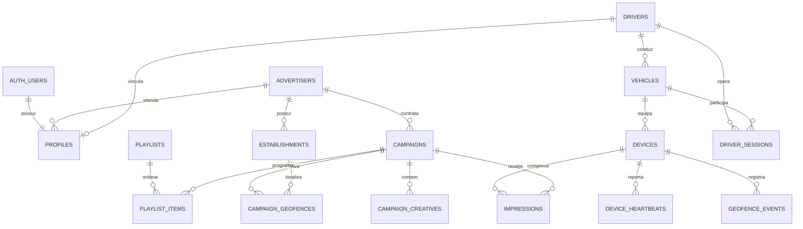

# MAXCAR — Arquitetura do banco de dados

## Escopo

MAX-002 estabelece a fonte de verdade, MAX-003 conecta identidade, anunciantes
e estabelecimentos e MAX-004 ativa campanhas, criativos, Storage e geofences.
O schema é reproduzido exclusivamente pelas migrations em
`supabase/migrations`; alterações manuais no Studio não são fonte de verdade.

## Modelo principal



## Tabelas

- `profiles`: extensão segura de `auth.users`, papel, vínculos e estado.
- `advertisers`: anunciantes e contatos comerciais.
- `establishments`: unidades físicas e ponto geográfico.
- `drivers`, `vehicles`, `devices`: cadeia operacional da frota.
- `campaigns`: período, janela diária, prioridade, cooldown e dias ativos.
- `campaign_creatives`: metadados, caminho privado, duração e checksum.
- `campaign_geofences`: raio e overrides ligados ao estabelecimento.
- `playlists`, `playlist_items`: grade regular ordenada.
- `geofence_events`: entradas, saídas e permanências detectadas pelo tablet.
- `impressions`: prova de reprodução e sincronização idempotente.
- `device_heartbeats`: telemetria operacional inicial.
- `driver_sessions`: sessões para horas e disponibilidade futuras.

Uma tabela genérica `device_telemetry` não foi criada: heartbeat cobre o piloto sem duplicar conceitos.

## PostGIS

Posições terrestres usam `extensions.geography(Point, 4326)`. Esse tipo calcula distâncias em metros sobre a superfície terrestre e evita conversões manuais frágeis. `establishments`, `geofence_events`, `impressions` e `device_heartbeats` possuem índices GIST quando a consulta espacial é relevante.

Consulta de referência para uma posição recebida:

```sql
select
  c.id,
  c.name,
  cg.radius_meters,
  extensions.st_distance(
    e.location,
    extensions.st_setsrid(
      extensions.st_makepoint(:longitude, :latitude),
      4326
    )::extensions.geography
  ) as distance_meters
from public.campaign_geofences cg
join public.campaigns c on c.id = cg.campaign_id
join public.establishments e on e.id = cg.establishment_id
where c.campaign_type = 'geo'
  and c.status = 'active'
  and cg.active
  and e.active
  and extensions.st_dwithin(
    e.location,
    extensions.st_setsrid(
      extensions.st_makepoint(:longitude, :latitude),
      4326
    )::extensions.geography,
    cg.radius_meters
  );
```

Horário, dia ativo, cooldown e frequência devem ser aplicados pelo motor de elegibilidade usando o timezone da região operacional; a query acima demonstra apenas a fundação espacial.

## Papéis e RLS

O papel vem de `profiles.role`, consultado por helpers `SECURITY DEFINER` no schema privado. Esses helpers usam `auth.uid()`, `search_path` vazio e permissões mínimas para evitar recursão de RLS e sequestro de objetos. Nenhum papel enviado pelo navegador participa da autorização.

| Domínio                          | Admin | Commercial | Operations            | Advertiser         | Driver          | Pending |
| -------------------------------- | ----- | ---------- | --------------------- | ------------------ | --------------- | ------- |
| Perfis                           | amplo | —          | —                     | próprio            | próprio         | próprio |
| Anunciantes/estabelecimentos     | gerir | gerir      | estabelecimentos: ler | próprios           | —               | —       |
| Campanhas/criativos/geofences    | gerir | gerir      | ler                   | próprios           | —               | —       |
| Motoristas/veículos/dispositivos | gerir | —          | gerir                 | —                  | próprios: ler   | —       |
| Playlists                        | gerir | ler        | gerir                 | —                  | —               | —       |
| Eventos/heartbeats               | ler   | —          | ler                   | —                  | próprios: ler   | —       |
| Impressões                       | ler   | ler        | ler                   | campanhas próprias | veículo próprio | —       |
| Sessões                          | gerir | —          | gerir                 | —                  | próprias: ler   | —       |

Um usuário recém-criado recebe `pending` pelo trigger de `auth.users`.
`super_admin` pode gerir todos os perfis. `admin` pode gerir perfis que não
sejam `super_admin`, mas não pode promover a esse papel nem alterar a própria
conta. A constraint de vínculo continua obrigatória para `advertiser` e
`driver`.

## APIs seguras do painel

- `save_establishment`: função `SECURITY INVOKER` que valida latitude/longitude,
  constrói o ponto WGS84 no banco e depende das políticas RLS da tabela.
- `establishment_admin_view`: view `security_invoker` que expõe latitude e
  longitude sem contornar RLS.
- `update_own_profile_name`: função pequena `SECURITY DEFINER` que permite
  alterar exclusivamente o próprio nome, sem abrir as colunas privilegiadas de
  `profiles`.
- `campaign_admin_view` e `campaign_geofence_admin_view`: views
  `security_invoker` para as listagens do painel sem contornar RLS.
- `simulate_geofence_eligibility`: RPC `SECURITY INVOKER` que valida a posição,
  calcula distância em PostGIS e aplica agenda básica.

## Constraints e idempotência

- Raios são positivos e limitados a 100 km.
- Prioridades ficam entre 0 e 100; cooldowns não podem ser negativos.
- Percentual de conclusão e bateria ficam entre 0 e 100.
- Períodos não podem terminar antes do início.
- Campanhas ativas exigem período, dia ativo e criativo; campanhas GEO exigem
  também uma geofence ativa.
- Geofences só vinculam campanhas GEO e estabelecimentos do mesmo anunciante.
- Paths de criativos precisam corresponder ao anunciante e à campanha.
- Posição de playlist é única dentro da playlist.
- `(device_id, client_event_id)` é único em `impressions`.

O tablet deve persistir um UUID estável por evento. Reenvios após perda de conexão produzem conflito de unicidade, não nova impressão.

## Timestamps

Eventos e períodos globais usam `timestamptz`. Janelas diárias usam `time` porque representam horário civil da região operacional. A futura camada de elegibilidade deve receber explicitamente o timezone da região; Campo Grande não é regra global.

`updated_at` é mantido por uma única função de trigger reutilizada nas entidades mutáveis.

## Delete e histórico

Relações históricas usam `RESTRICT` ou `SET NULL`. Não há cascata de anunciante para campanhas, nem de campanha para impressões. A operação normal usa status e `active` em vez de hard delete. Apenas `profiles` acompanha a exclusão da conta correspondente em `auth.users`.

## Índices e crescimento

Índices cobrem FKs de consulta, status, agenda, últimos sinais, séries temporais por dispositivo/campanha e posições geográficas. Heartbeats e impressões permanecem em PostgreSQL durante o piloto. Particionamento e retenção só serão introduzidos quando volume medido justificar.

## Migrations, seed e testes

As migrations são aplicadas em ordem de responsabilidade.
`supabase/seed/development.sql` contém apenas dados fictícios e coordenadas
plausíveis marcadas para desenvolvimento. Testes pgTAP validam objetos,
constraints, PostGIS, idempotência, hierarquia administrativa e isolamento RLS.

```bash
npm run db:start
npm run db:reset
npm run db:lint
npm run db:test
npm run db:types
```

O bucket `campaign-media` é privado. Nenhuma política de escrita foi aberta nesta fase; uploads autenticados e leitura por credencial revogável de dispositivo serão definidos posteriormente.
